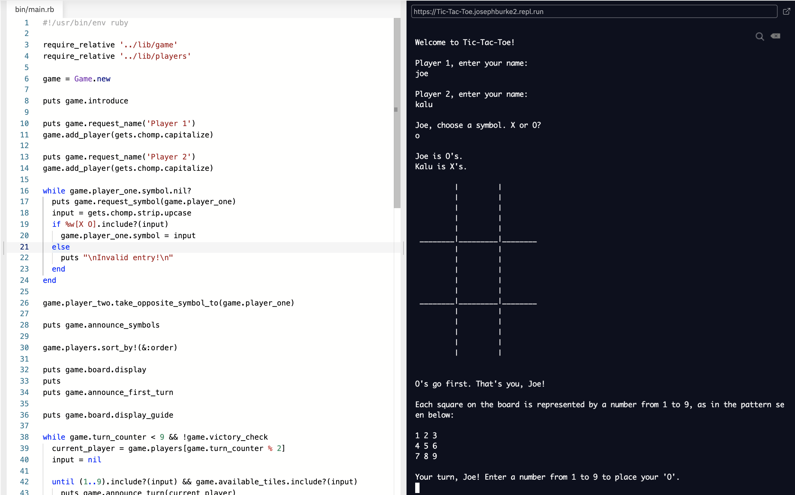
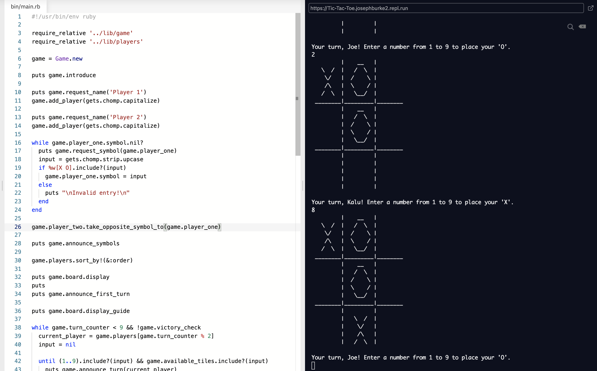
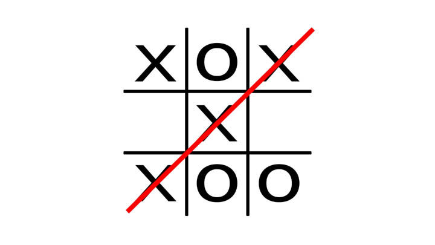

# Tic, Tac, Toe

Welcome to Joe and Kalu's 'Tic, Tac, Toe' project, part of the Ruby module in the Microverse course. Tested with Ahmad.

For this project, we wrote a Ruby script that allows the user to play a game of Tic, Tac, Toe in the Terminal.

## How To Play

'Tic, Tac, Toe' is a traditional game for two players played on a board with 9 squares.

Each player is represented by a symbol, either 'X' or 'O'. The players then take turns to place their respective symbols in an empty square on the board, with O's going first - in our version of the game, these squares are represented by the numbers 1 to 9.

The aim of the game is to have three of your symbols form a line, be it vertically, horizontally or diagonally, as illustrated in the image below.

In the event that all 9 squares are taken without either player getting three of their symbols in a line, a draw is declared.

### Accessing The Game

- To quickly play the game, follow the link in the Live Demo section and hit the Run button in the header. The game will begin in the window on the right.

- To download the contents of this repository and play the game locally, follow the steps in the 'Local Installation' section.

## Built With

-   Ruby
-   VS Code
-   Ubuntu and Mac OS
-   Rubocop

## Live Demo

For a live demo of this project, visit [this repl.it](https://repl.it/@JosephBurke2/Tic-Tac-Toe#bin/main.rb).

There are no pre-requisites for enjoying the game through this method.

## Local Installation

### Prerequisites

If you intend to download the project, you will need to have Ruby already installed on your machine. For more information on how to install Ruby, follow [this link](https://www.ruby-lang.org/en/downloads/).

### Installation Instructions

To get your own copy of our project simply clone the repository to your local machine.

**Step 1**: Using the Command Line, navigate into the location where you would like to have the repository. Then enter the following line of code:

_git clone <https://github.com/Joseph-Burke/Tic-Tac-Toe>_

**Step 2**: Once the repo has been cloned, navigate inside it by entering the following command:

_cd Tic-Tac-Toe_

**Step 3**: Once in the root directory of the repository, simply enter the following line of code to start a game:

_ruby bin/main.rb_

From there, the game will begin, and the user need only follow the subsequent instructions that appear in the Terminal.

## Testing Instructions

**Step**: Using the Command Line, navigate into the location where the project is saved. Then enter the following line of code:

_rspec_

## Repository Contents

The code for the project is divided into two main directories: **./bin** and **./lib**.

The **./bin** folder contains the executable **main.rb** file. This is the only file that contains the Kernel.puts and Kernel.gets methods, allowing for interaction with the game via the Terminal. _This is the only file that should be run if you want to play the game._

The **./lib** folder contains subsidiary files that set up all of the classes and methods used in bin/main.rb

- **players.rb**, where the Player class is defined.
- **game.rb**, where the Game class is defined.
- **board.rb**, where the Board class is defined.
- **tile.rb**, where the Tile class is defined.

In addition to the above, the repo also contains .rubocop.yml for linting, an ./assets folder to store images used in this README.md file and ./spec folder to store testing files using Rspec.

## Authors

👤 **Joseph Burke**
- Github: [@Joseph-Burke](https://github.com/Joseph-Burke)
- Twitter: [@__joeburke](https://twitter.com/__joeburke)
- LinkedIn: [Joseph Burke](https://www.linkedin.com/in/joseph-burke-b7a8261a5)

👤 **Kalu Agu Kalu**

- Github: [@Godswilly](https://github.com/Godswilly)
- Twitter: [@KaluAguKalu17](https://twitter.com/KaluAguKalu17)
- LinkedIn: [Kalu Agu Kalu](https://www.linkedin.com/in/kalu-agu-kalu/)

👤 **Ahmad Chata**

- Github: [Ahmad Chata](https://github.com/ahmadchata)
- Twitter: [Ahmad Chata](https://twitter.com/ahmadchata)
- LinkedIn: [Ahmad Chata](https://www.linkedin.com/in/ahmad-chata-957b9b51)

## 🤝 Contributing

Our favourite contributions are those that help us improve the project, whether with a contribution, an issue, or a feature request!

Feel free to check the [issues page](https://github.com/Joseph-Burke/Tic-Tac-Toe/issues) to either create an issue or help us out by fixing an existing one.

## Show your support

If you've read this far....give us a ⭐️!

## 📝 License

This project is licensed by Microverse and the Odin Project
